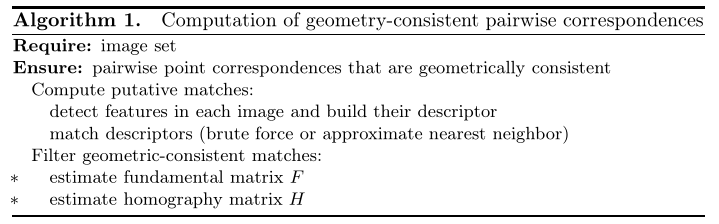
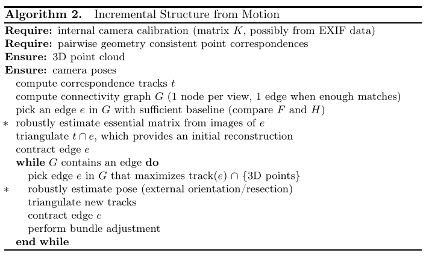
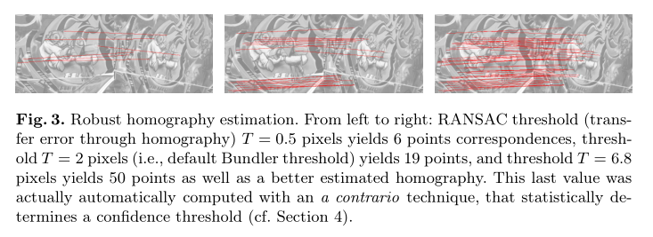
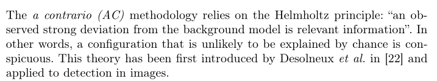
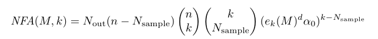
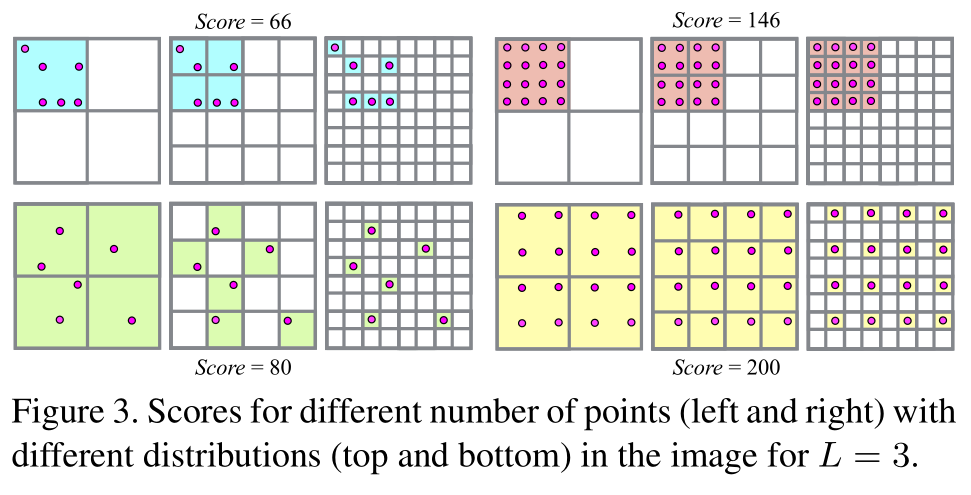

### Adaptive Structure from Motion with a Contrario Model Estimation

1.针对问题：增量式sfm中会进行多次单应性矩阵+基础矩阵+本质矩阵+相机位置的模型计算。其中的的估计门限往往是全局固定的。

2.创新点：自适应的门限能获得更好的精确度。

3.introduction：SFM中大多数算法旨在处理大量的数据，但是鲜有考虑重建的精度。增量式的sfm选取的最优种子图像对，并不能保证计算能收敛到全局最优解。它们的实现往往依赖多次的光束平差（hard thresholds）。全局sfm的优势是能通过凸优化或者线性优化找到全局最优解（通过直接最小化最大重投影误差而不是总的平方差），但是在处理离群点和large problem上计算复杂。增量式为一些非线性的提供了减少累计误差的空间（drift）。

4.组成部分：基本原理+模型估计+本文算法+实际表现。

5.camera pose=motion, structure=poins;

6.单应性估计用来选择既有大量匹配又有大的基线的种子对。然后点和相机位姿都是通过这些点的匹配关系计算的。

7.state of the art系统都依赖于RANSAC，该算法存在经验设置的threshold。

8.全局sfm分为两步：全局连续的相机旋转关系通过两两计算得到+然后通过L范数来处理离群点并获得structure和变换关系。增量sfm是多次的经验threshold指导下的robust estimation。

9.RANSAC:随机抽样一致算法

> 选取N个点对模型进行拟合+找容差范围$\sigma$内的点+迭代上述过程iterator次。

$\sigma$太小加入的在群点过少，太大则混入离群点。现实的要求是：根据每一对图像的情况自动选取合适的阈值。

10.原理

 如果一个结构不能简单用偶然性来解释的话，那么它就是一个显著的相关信息。“一个观察到的与背景模型存在的显著差异是相关的信息”。AC-RANSAC试图在一个给定的NFA范围内找到一个一致集合。

NFA=number of false alarms, 它要求在给定的背景模型中的可信度度量。这个可信度度量是模型的残差。

### structure from motion revisited

1.图像匹配的步骤中如果两两计算复杂度非常大。现代先进的一般都采用图像的重叠聚类。

2.场景图递增策略：找到基本矩阵，如果超过一个在群点下限，那么认为是有几何关系的。然后再次检测对于单应矩阵和本质矩阵的在群点比例。

然后通过本质矩阵的求解，来判断一对图像之间究竟是平移还是旋转。

3.考虑了对WTF类型图像的选择策略。对于确定好了的图像对进行分类：一般、全景、平面。从而避免全景图对于模型的退化。

4.下一个最好的视图的选择：最小化重建误差准则。当重复落入一个单一的格子的时候，考虑使用更小的网格。

5.针对当时的track技术不能在高离群点的场景中找到，提出一种基于采样的三角化技术。

6.Bundler对所有轨迹元素的成对组合进行采样，进行三角化，如果找到一个条件良好的解，则在整个轨迹上进行三角化。该方法对异常值不具有鲁棒性，因为它不可能恢复合track中的独立点。此外，由于穷尽成对三角剖分，该算法的计算代价较大。

