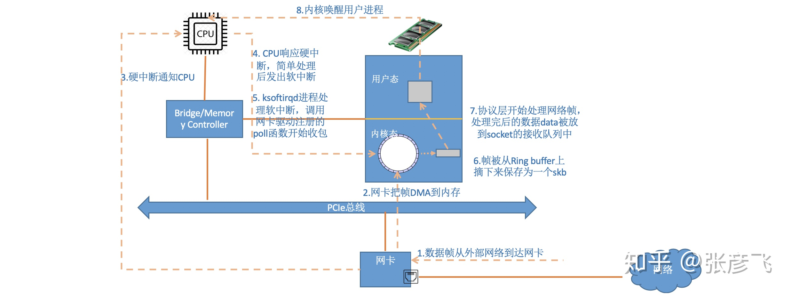

## 现代操作系统

### 一、死锁

1. 内涵

   > 1. 规范定义：一些进程集合，所有进程都在等待其他进程才能引发的事件，那么这个集合就是死锁的。
   > 2. 死锁分类：**资源死锁（软硬件）+通信死锁**
   > 3. 死锁条件：**资源状态互斥（非共享）+资源不可抢占（非抢占）+占有与等待（非释放）+进程环路等待（非开环）**

2. 解决死锁的方法：

   > 死锁防止+死锁避免+死锁检测与恢复（前期，中期，后期）
   >
   > - 死锁防止=破坏四个条件（共享+抢占+释放+开路）
   > - 死锁避免=银行家算法
   > - 死锁检测=检测有向图是否存在环；
   > - 死锁恢复=资源剥夺+杀死进程+重启系统+进程回退

3. 银行家算法不太实用：进程无法预知自己所需资源的最大值+进程数目不是固定的+资源可能突然不可用。

4. 其他与锁相关的问题：

   **两阶段加锁**：一个典型的std::lock, 但是并不能避免死锁的问题。

   **通信死锁**：一般可以通过超时技术解决，但是不是通信在网络中发生的都是通信死锁：缓冲区环；

   **活锁**：一直消耗CPU但是既没有进展也没有死锁(比如忙等)的现象，称为活锁；

   **饥饿**：进程的优先级太低导致一直得不到执行。

### 二、锁攻略

锁的种类=**自旋+互斥+读写；悲观锁+乐观锁**

1. 自旋锁：忙等待。

2. 互斥锁：阻塞

3. 读写锁

   - 读优先锁：读线程可以持续加锁，无读才写。
   - 写优先锁：写线程排队时，读锁失败。
   - 公平读写锁：读写入队列。

   上述都是悲观锁，认为多线程同时修改资源的概率比较高，所以访问之前都先要上锁。

4. 乐观锁：全程没有加锁，操作完成后如果发现有其他线程改了这个资源，那么就放弃这次操作。如：在线文档。

   原理：更新时，判断版本号是否一致，如果不一致，更新失败。

### 三、进程与线程

1. 进程是资源分配的基本单位；线程是程序执行的基本单位。

2. 进程拥有自己的资源空间，启动一个进程，系统就会为它分配地址空间；而线程与CPU资源分配无关，多个线程共享同一进程内的资源，使用相同的地址空间。

3. 一个进程可以包含若干个线程。

4. 线程的状态？

   > **新建状态+就绪状态+运行状态+阻塞转态+死亡状态；**
   >
   > 前面四个状态都能走向死亡状态；
   >
   > new一个线程的时候，成为新建态；
   >
   > 当start方法返回之后，成为就绪态；
   >
   > 获得CPU时间片之后称为运行态；
   >
   > 让出CPU成为阻塞态；
   >
   > 正常退出或者异常终止成为死亡态。
   
5. 回答模板

   > - 历史事件顺序：进程、线程、协程（thread per msg开销仍然很大）
   > - 进程是资源分配的基本单位，线程是CPU调度的基本单位，协程对内核不可见，由与用户进程控制。
   > - 进程间信息难以共享要使用IPC的方式，线程间可以方便快速地在共享的内存中间中通过同步来访问和修改数据。
   > - 进程的fork创建的代价相对较高，线程的clone要快十倍以上。这是因为线程的诸多属性不必复制。
   >
   > 线程间共享的内容有：进程ID、父进程ID、打开的文件描述符、文件系统相关信息、CPU时间消耗、资源消耗等；
   >
   > 独有的内容有：线程ID、信号掩码、自己的独有的栈空间。
   >
   > 

### 四、线程顺序化执行

1. 无线程间通信:

   - **上帝之手：**子线程的join方法，子线程干完活主线程才能往下走。

   - ​    **cv:**          使用条件变量cv+串联式的通知信号flag+mutex：mutex配合cv.wait/notify方法。
   - **detach ：**   线程先嵌套,当前一个线程的某个动作执行完毕之后再新建线程并detach。
   - **future  ：**   std::future<bool>x=std::async(func,args)
   - **promise：**  std::promise<void>x, 第一个线程中操作x,x.set_value(),然后在另一个线程中x.get_future().wait();
   -  **atomic:**     设置多个std::atomic<bool>x{false};然后逐个解锁。 

2. 使用线程间通信,略。

### 三、虚拟内存

1. 定义：

   系统内存管理技术，使得应用程序认为自己有一个完整的连续可用的地址空间；实际上内存通常被分割为多个物理内存碎片。

2. 实现方式：

   - 请求分页存储管理
   - 请求分段存储管理
   - 请求段页式存储管理

3. 优点：

   - 避免用户直接访问物理内存，防止一些破坏性的操作。
   - 使得用户程序可以使用比实际物理内存更大的地址空间。

4. 缺点：

   - 额外的内存维护管理虚拟内存。
   - 虚拟地址到物理地址的转换。
   - 页面的换入换出需要磁盘IO。
   - 一页可能只有很少的数据。

5. 缺页中断：

   malloc和mmap等内存分配函数只是建立了进程虚拟地址空间，没有分配对应的物理内存，当进程访问没有建立映射关系的虚拟内存时，处理器会自动出发一个缺页中断，此时操作系统会根据页表的外存地址将其调入内存。

6. 页面置换算法：**OPT+LRU+FIFO+CLOCK**

   - 最佳置换算法OPT：每次淘汰的都是以后不使用或者最长时间不被访问的页面。（过于理想无法实现）
   - 先进先出置换算法FIFO：最简单，脱离实际，算法性能差。它会导致增加内存块数缺页次数反而增多的情况，称为belady异常。
   - 最近最久未使用算法LRU：选择最近一段时间内最久没有用的页面予以淘汰。
   - 时钟置换算法CLOCK：[博客](https://blog.csdn.net/Gu_fCSDN/article/details/103979067?utm_medium=distribute.pc_relevant.none-task-blog-baidujs_baidulandingword-1&spm=1001.2101.3001.4242)
   - 改进的时钟置换算法；

### 四、进程间通信

七大方式：**信号+信号量+文件+管道+共享内存+消息队列+socket**

1. **信号**：一种比较复杂的通信方式，用于通知接收进程某个事件已经发生。

   > - 硬件层面有中断，软件层面有某些系统函数以及一些非法运算操作。
   > - 最常发送信号的系统函数有kill、raise、alarm、setitimer、sigqueue、abort等。

2. **文件**：使用read和write，为了实现同步，还需要借助信号。

3. **管道**：分为命名管道和无名管道

   > - 无名管道：父进程创建管道并在管道中写入数据，子进程读出数据。<unistd.h>中的pipe(int pipefd[2])函数；【必须有亲缘关系】
   > - 命名管道：提供一个路径名与命名管道关联，以FIFO文件形式存储在文件系统中，不必有亲缘关系。<sys/types.h>+<sys/stat.h>.
   > - 二者异同：
   >   - 相同点：open打开指针，都是半双工，都需要使用write/read。
   >   - 不同点：是否需要亲缘关系。

4. **共享内存**：最快的IPC，因为不需要来回复制。

   > - 主要API：mmap+munmap+shmget+shmat+shmdt;

5. **信号量**

   > - 是一个整形的计数器；信号量是停车场，值是空余的车位。
   > - 使用：信号量容易出错，使用mutex+condition_variable可以达到同样的效果，并且更加安全。

6. **消息队列**[知乎](https://zhuanlan.zhihu.com/p/146106297)

   > - 使用场景：异步+削峰+解耦；
   > - 异步：**下单-优惠券-积分-短信-结束**；用户的下单操作完成以后，不用考虑后台做的事。为什么不能用多线程去做：难写并且难以排查。
   > - 削峰：秒杀系统时，把请求放到队列中，等高峰下去服务的压力也就没了。
   > - 缺点：
   >   - 系统复杂性=重复消费+消息丢失+顺序消费
   >   - 数据一致性=分布式事务（下单后边的系统放在一个事务中）。
   >   - 可用性=中间件如果挂了怎么办？
   > - 开源MQ：主从式=ActiveMQ+RabbitMQ，分布式=RocketMQ+Kafka；

   > \#include <sys/types.h> #include <sys/ipc.h> 
   >
   > #include <sys/msg.h>
   >
   > **消息队列函数：msgget+msgctl+msgsnd+msgrcv**

   

7. socket

### 五、linux收包总览

1. 在网络协议栈中，网卡负责链路层协议+内核负责网络层和传输层并提供应用层上socket接口+应用层包括Nginx、FTP、HTTP等。

2. 内核和网络设备驱动是通过中断工作的，网络任务比较复杂和耗时，在中断中处理完会过度占用CPU，因此linux中断函数会分为上半部和下半部。上半部只进行简单的处理，然后快速释放CPU。下半部实现的方式是软中断，硬中断是通过给CPU物理引脚施加电平变化，软中断是内存当中的一个flag，可以是一个比特或者是一个变量。

3. 内核收包的示意：

   

4. 其他的太多，暂时不写了。

### 六、IO模式

1. 两阶段：

   一次IO会经历两个阶段：

   - 等待数据准备
   - 将数据从内核拷贝到进程中

2. 所以产生了五种IO模式

   - **阻塞式IO**

     两阶段block=内核等待数据，进程等待数据。:apple:普通的socket程序

   - **非阻塞式IO**

     内核等待数据，用户可以不断询问内核。

   - **IO多路复用**

     select+poll+epoll，也称事件驱动IO，使得单个进程可以处理多个IO。实际上socket的IO是非阻塞的，而用户进程是被select/poll/epoll阻塞的。

   - **异步IO**

     用户和内核互不干扰，干完事发一个消息即可。

   - **信号驱动IO**

     fd就绪的时候让内核向用户发送SIGIO信号。

### 七、IO复用[详解](https://segmentfault.com/a/1190000003063859)

1. **网卡**接收数据通过南桥北桥到内存。

2. 网卡向CPU发送**中断**。

3. OS执行**中断程序**（创建网络相关进程+将网络数据收取到对应socket缓冲区中+唤醒网络进程）。

4. socket接收到数据以后，OS将处于等待队列中的网络进程A唤醒（重新放到工作队列中）继续执行。

   - OS通过网络数据的port找到对应的socket进程。
   - OS通过poll、select、epoll来监视多个socket。

   > - **select方法**：
   >
   >   - [x] A维护一个socket数组S。
   >
   >   - [x] select时，遍历S，如果没有数据，阻塞进程A，并且把A加入到socket的等待队列中。
   >
   >   - [x] 某个socket有数据时，通过中断程序把A从所有等待队列中移除并加入到工作队列，然后返回第二步。
   >
   >     【缺点】：每次select都需要将A加入到所有监视的socket的等待队列，每次唤醒都要从这些队列中移除。
   >
   >     ​		  每次select都要fd 集合从用户态拷贝到内核态。
   >
   >     ​		  每次select都要fd 集合在内核中遍历。
   >
   >     ​		  支持的文件描述符只有1024。		  
   >
   >     【优点】：跨平台，有支持。
   >
   > - **poll方法：**
   >
   >   - [x] 使用链表来维护进程所监控的所有socket，所以poll没有了socket的并发数目的限制。
   >   - [x] 采用pollfd而非fd_set格式。
   >
   > - **epoll方法**：【下文中引用socket实际上是引用socket的外包装epitem】
   >
   >   - [x] **epoll_create:**内核创建epfd对象，其中包含等待队列Wq+就绪列表rdlist+红黑树。
   >
   >   - [x] **epoll_ctl：**  注册每一个socket（其等待队列项是），填充红黑树。（增删改对某个socket的监听）
   >
   >     【当socket有数据，中断程序会给rdlist添加该socket的引用，并且唤醒epfd的等待队列中的进程A】
   >
   >   - [x] **epoll_wait**： A中的epoll_wait被执行时，如果此时rdlist不为空，那么可以直接返回，否则阻塞进程。
   >
   >     【即把A放到epfd的等待队列中去】

5. 番外

   > - 服务端accept之后创建的新的socket。创建之后把它挂载到当前进程的打开文件列表中即可。
   >
   > - 新的socket中除了内核空间指针file之外还有一个核心成员sock；前者掌管内存分配，后者掌管发送接收等待队列及三次握手。
   >
   > - epoll_create创建的epfd会挂载在A的打开文件列表中。
   >
   > - epoll_ctl首先会（1）**分配**一个红黑树的epitem节点对象，该对象保管epfd和socket fd；
   >
   >   ​			   （2）设置socket的等待队列（拉取socket中sock结构的指针）+新建等待队列项（回调函数和epitem指针）并注					册回调函数；
   >
   >   ​			   （3）将epitem插入红黑树。
   >
   >   ​		这里之所以使用红黑树而不是哈希表的原因：哈希可能最大的复杂度；红黑树增删改查复杂度比较均衡。
   >
   > - epoll_wait:(1)如果没有socket就绪，自己加入到epfd等待队列中，并且阻塞。
   >
   >   ​		   (2)当socket有数据来的时候，软中断找到回调函数，回调函数做两件事：
   >
   >   a、找到epitem，并将epitem加入epfd的rdlist当中去。
   >
   >   b、如果epfd的等待队列为空，软中断可以下班了，如果有等待者，那么wake_up这个等待进程A。A就可以去扫描rdlist了。
   >
   > - 

6. poll与epoll的区别：

   - 进程分离：poll会给socket等待队列直接添加进程A，而epoll添加epfd对象，将socket与进程分离。

      - 逻辑分离：将维护和阻塞分开，使用epoll_ctl维护等待队列+epoll_wait阻塞进程。
      - 轮询优化：进程在poll中会轮询所有socket，而epoll中只需要轮询rdlist.

7. epoll工作模式

   - select和poll只支持LT工作模式，epoll的默认的工作模式是LT模式。

   - LT水平触发 和 ET边缘触发的区别：

     LT :epoll_wait检测到fd事件发生并通知给应用程序，应用程序不必立即处理该事件，下次调用继续上报该事件。

     ET: epoll_wait检测到fd事件发生并通知给应用程序，应用程序必须立即处理该事件，否则下次调用不会再上报。

   - ET高速的原因以及要求

     原因：减少了epoll事件被重复触发的次数，所以效率更高。

     要求：必须使用非阻塞套接字，避免一个socket的阻塞导致处理多个socket的任务饿死。

### 八、Reactor和Proactor

1. Reactor的背景

   > 1. 可以创建一个线程池，将连接分配给线程，这样一个线程就可以处理多个socket的连接业务。
   >
   > 2. 由于一个线程要处理多个socket，所以必然要把socket改成非阻塞式的。
   >
   > 3. 多个连接时，可以使用轮询，但是连接越多，轮询的代价越大。
   >
   > 4. IO多路复用通过系统调用监听所有连接，从而可以获取内核中的多个事件。
   >
   >    ``如果没有连接=阻塞；如果有事件发生，找到相应业务并处理。``
   >
   > 5. 为了提高开发的效率，我们把IO多路复用做了一层封装，从而不必考虑底层网络的细节。然后称之为Reactor模式。

2. **Reactor模式** 非阻塞同步网络模式

   - 有两个核心组件，分别是Reactor和线程池。

     reactor负责监听和分发事件；线程池负责处理事件。

     阻塞等待有两个过程，分别是【内核数据准备好】+【数据从内核拷贝到用户态】两个过程。作为非阻塞式的IO，当read请求在第一步数据还没有准备好的时候，立即返回；指导准备好了，才通过同步的方式将数据从【内核态拷贝到用户态】。所以无论是阻塞式还是非阻塞式IO，都是同步调用。

     四种排列组合：其中【多reactor单线程】相比其他三种并没有啥优势。

   - 单reactor单进程（redis）

     reactor通过select监听事件，根据事件类型决定分发给acceptor/handler。

     优点：只有一个线程，实现简单无需进程间通信以及资源竞争；

     缺点：无法充分利用CPU，可能造成延迟。

   - 单reactor多线程（CHAT）---单 Reactor 多进程消耗太大，一般都是线程。

     reactor通过select监听事件，根据事件类型决定分发给acceptor/handler；

     但是handler并不直接处理业务，而是把业务下发给线程池，然后线程将结果返回给handler。

     优点：充分利用多核优势。

     缺点：需要资源共享+一个reactor可能在高并发的时候并不够，所以引出第三种模型。

   -  单reactor多线程（多进程Nginx，多线程netty）

     核心：主reactor将连接分配给subreactor继续进行监听。

     Reactor模式

2. **Proactor** 异步网络模式
   
   - 发起异步读写请求时，需要传入数据缓冲区的地址等信息，内核自动把数据读写工作完成，所以这里的读写工作全部都系统代劳，完成之后就会通知进程直接处理数据.
   
4. 两者的区别：

   Reactor模式是基于待完成的IO事件，Proactor是基于已完成的IO事件。

   

   

   

   

   

   

   

   

   

   

   

   

   

   

   

   

   

   

   

   

   

   

