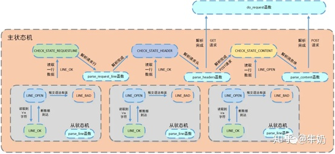

### 基于muduo库的集群聊天服务器

1. Nginx的作用

   - 反向代理=客户端不需要知道真实的服务器是哪台。
   - 负载均衡=轮询+加权轮询+IP哈希(session从ip计算)。
   - 动静分离=静态资源直接从Nginx返回。


### Web服务器项目

作者：牛奶
链接：https://zhuanlan.zhihu.com/p/269247362
来源：知乎
著作权归作者所有。商业转载请联系作者获得授权，非商业转载请注明出处。


**该项目地址：[Yoka416/TinyWebServer](https://link.zhihu.com/?target=https%3A//github.com/Yoka416/TinyWebServer)**

**1、简单介绍一下你的项目？**

这个项目主要的目的是对**浏览器的链接请求进行解析处理，处理完之后给浏览器客户端返回一个响应，如文字图片视频等**。服务器后端的处理方式**使用socket通信，利用多路IO复用**，可以同时处理多个请求，请求的解析使**用预先准备好的线程池**，使用模拟proactor模式，**主线程负责监听**，监听到有事件之后，从socket中循环读取数据，然后将读取到的数据封装成一个请求对象插入请求队列。睡眠在请求队列上的**工作线程被唤醒进行处理**。处理的方式用**状态机**。

对请求文件的处理：客户端发出链接，到达服务器，服务器这端先用read_once（）函数一次性把所有请求读到缓冲区。然后process_read函数分别调用用三个函数对缓冲区的内容进行解析。主状态机主要用于解析客户端请求，从状态机用于解析一行内容并把每一行加\0\0格式化，方便主状态机解析，主状态机调用解析请求行，请求头，请求内容三部分函数进行解析。解析结束后利用do_request（）函数生成响应报文，该函数会根据不同的网址url产生不同响应体。最后通过write函数里套接字的传输方式把响应体传给客户端。

日志分为**同步日志和异步日志**，异步日志利用阻塞队列，先将日志放入阻塞队列中，然后利用条件变量将日志添加到对应文件中。采用**单例模式**。

日志系统初始化函数中主要要做的事：如果文件名没带路径，直接放到log_full_name。如果带路径，把文件名取出来放到log_name，把路径取出来放到dir_name，然后把时间+log_name放到log_full_name。

在write_log（）函数中，这里面有两部分，一部分是对新的文件名，时间，日志名进行再次处理，一部分是时间+新加入的日志参数放入缓冲区。异步加入阻塞队列，同步直接写入日志文件。阻塞队列是用数组模拟的生产者消费者模式。根据初始化函数传入的最后一个参数阻塞队列最大容纳值判断是同步还是异步，异步则其大于等于1。

用**单例模式创建了数据库连接池**。数据库链接池中，提前创建一定量的数据链接，并把他们保存在双向链表中。

**用定时器处理非活动链接，定时器容器利用升序链表进行设计**。

参考链接：[小白视角：一文读懂社长的TinyWebServer](https://link.zhihu.com/?target=https%3A//huixxi.github.io/2020/06/02/%E5%B0%8F%E7%99%BD%E8%A7%86%E8%A7%92%EF%BC%9A%E4%B8%80%E6%96%87%E8%AF%BB%E6%87%82%E7%A4%BE%E9%95%BF%E7%9A%84TinyWebServer/%23more) 


**2、面试官问这个web服务器是你自己申请的域名么？域名号是多少？**

没有申请，因为服务器是放在同一网段的虚拟机里，然后在本地的浏览器里面访问。

或者也可以在同一局域网的不同主机下实验，在同一局域网下通过私有IP+端口号就可以访问。

又或者或者直接把服务器程序放在本地，然后使用本地回环地址127.0.0.1就可以。

本地回环地址主要作用有两个：一是测试本机的网络配置，能PING通127.0.0.1说明本机的网卡和IP协议安装都没有问题；另一个作用是某些SERVER/CLIENT的应用程序在运行时需调用服务器上的资源，一般要指定SERVER的IP地址，但当该程序要在同一台机器上运行而没有别的SERVER时就可以把SERVER的资源装在本机，SERVER的IP地址设为127.0.0.1同样也可以运行。


## 3线程池相关问题

### 1.手写线程池

下面是C++实现的简易线程池，**包含线程数量，启动标志位，线程列表以及条件变量**。

其中**构造函数**主要是声明未启动和线程数量的。**start函数**为启动线程池，将num个线程绑定threadfunc自定义函数并执行，加入线程列表。**stop**是暂时停止线程，并由条件变量通知所有线程。**析构函数**是停止，阻塞所有线程并将其从线程列表剔除后删除，清空线程列表。

```text
#include<vector>
#include<string>
#include<list>
#include<thread>
#include<condition_variable>
using namespace std;
class ThreadPool {
public:
	ThreadPool(int threadnum):started(false),thread_num(threadnum) {

}
~ThreadPool()
{
	stop();
	for (int i = 0; i < thread_num; ++i) {
		threadlist[i]->join();
	}
	for (int i = 0; i < thread_num; ++i) {
		delete threadlist[i];
	}
	threadlist.clear();
}
void threadFunc(){}//线程执行函数,可自定义。
int getThreadNum() { return thread_num; }
void start() {
	if (thread_num > 0) {
		started = true;
		for (int i = 0; i < thread_num; ++i) {
			thread* pthread = new thread(&threadFunc, this);
			threadlist.push_back(pthread);
		}	
	}
}
void stop() {
	started = false;
	condition.notify_all();
}

private:
	int thread_num;
	bool started;
	vector<thread*> threadlist;
	condition_variable condition;
};
```

**你C++用过什么设计模式？讲一讲。**

在设计日志系统的时候，用过单例模式。

我觉得没有比这个链接讲单例模式讲的更好的了：[shellmad-c++_44 单例模式的原理及实现_哔哩哔哩 (゜-゜)つロ 干杯~-bilibili](https://link.zhihu.com/?target=https%3A//www.bilibili.com/video/BV1Gz4y1d7RJ%3Ffrom%3Dsearch%26seid%3D11312816026407113318) 

我总结下：单例模式的目的就是，用户在调用该类的时候，只能使用建立一个该类对象。于是呢就把该类的构造函数给私有化了，这样外部就根本没办法直接实例化调用该类，只能类内部调用。这时候就在类内部创建一个公有化的函数，然后让该函数返回一个该类的指针，这样外部就可以通过这个函数调用该类了。但是问题是，调用该成员函数必须实例化一个该类对象，而现在已经不能实例化该类对象了，所以为了可以成功调用该函数，把该函数设置为静态函数，静态函数的作用范围是全局整个文件，这样外部就可以调用了。

但是这样的话实际上并不能保证主函数调用时该类对象指针的唯一性，因为该静态成员函数每次返回的都是一个新的new出来的值。每次都不一样。于是办法就是设置一个私有化的静态对象指针，在外部初始化这个指针为空。在静态成员函数中，如果该静态指针为空就创建对象指针，否则直接返回对象指针。这样就确保了在外部使用时，该对象的唯一性。

但是问题又来了，这样做可能会导致内存泄漏，因为你静态成员函数申请的指针并没有释放，还需要用户手动释放。改动的话就把该静态成员函数中的创建指针改为创建一个静态对象成员，然后返回该成员的地址。

但是返回一个地址就需要用指针去接收，用户就有可能对该指针进行delete造成错误，所以直接静态成员函数返回一个引用更好。这样delete就会无效。

又但是引用之后，主函数可以通过赋值号产生新的类对象。突破了唯一性的设定。所以现在又需要对拷贝构造函数进行私有化设置。或者直接对拷贝构造=delete，进行禁用。又或者把默认的运算符重载给禁用了。

代码如下：

```text
#include<iostream>
#include<stdlib.h>
#include<algorithm>
#include<vector>
#include<string>
using namespace std;

class Singleton{
public:
	~Singleton(){
	printf("~Singleton() destruct");
	}
	static Singleton& CreateObject()
	{
		static Singleton obj;
		return obj;
	}
	
	//Singleton(Singleton& obj=delete;编译不能通过，但事实也可以
private:
	Singleton(){
	printf("Singleton() Construct");
	}
	Singleton(Singleton& obj){
	printf("Singleton(Singleton& obj) Construct");
	}
};
int main(){
	Singleton& p0bj1=Singleton::CreateObject();

	return 0;
    }
```


### 2.线程的同步机制有哪些？

现在流行的进程线程同步互斥的控制机制，其实是由最原始，最基本的**4种方法**实现的：

l 临界区：通过多线程的互串行访问公共资源或一段代码，速度快，适合控制数据访问。

临界区和锁差不多（[临界区的使用](https://link.zhihu.com/?target=https%3A//www.cnblogs.com/sjxbg/p/5767527.html)）

l 互斥量（ 又称为互斥锁）：为协调共同对一个共享资源的单独访问而设计。只有拥有互斥对象的线程才有权限去访问系统的公共资源，因为互斥对象只有一个，所以能够保证资源不会同时被多个线程访问。

l 信号量：为控制一个具有有限数量的用户资源而设计。它允许多个线程在同一时刻去访问同一个资源，但一般需要限制同一时刻访问此资源的最大线程数。

l 事件：用来通知线程有一些事件已发生，从而启动后继任务的开始。

条件变量。


### 3.线程池中的工作线程是一直等待吗？

线程池中的工作线程是处于一直阻塞等待的模式下的。因为在我们创建线程池之初时，我们通过循环调用pthread_create往线程池中创建了8个工作线程，工作线程处理函数接口为pthread_create函数原型中第三个参数函数指针所指向的worker函数（自定义的函数），然后调用线程池类成员函数run（自定义）。*-------这里可能会有疑问？为什么不直接将第三个参数直接指向run函数，而是要通过向worker中传入对象从而调用run呢？**原因是**因为我们已经将worker设置为静态成员函数，而我们都知道静态成员函数只能访问静态成员变量，所以为了能够访问到类内非静态成员变量，我们可以通过在worker中调用run这个非静态成员变量来达到这一要求。*在run函数中，我们为了能够处理高并发的问题，将线程池中的工作线程都设置为阻塞等待在请求队列是否不为空的条件上，因此项目中线程池中的工作线程是处于一直阻塞等待的模式下的。

### 4.你的线程池工作线程处理完一个任务后的状态是什么？

这里要分**两种**情况考虑

（1） 当处理完任务后如果请求队列为空时，则这个线程重新回到阻塞等待的状态

（2） 当处理完任务后如果请求队列不为空时，那么这个线程将处于与其他线程竞争资源的状态，谁获得锁谁就获得了处理事件的资格。

### 5.如果同时1000个客户端进行访问请求，线程数不多，怎么能及时响应处理每一个呢？

首先这种问法就相当于问服务器如何处理高并发的问题。

本项目中是通过对子线程循环调用来解决高并发的问题的。

**具体实现过程如下：**

如上文所述，我们在创建线程的同时时就调用pthread_detach将线程进行分离，这样就不用单独对工作线程进行回收，但是一般情况只要我们设置了分离属性，那么这个线程在处理完任务之后，也就是子线程结束后，资源会被自动回收。那这种情况下我们服务器基本就只能处理8个请求事件了（线程池里只有8个线程）。那怎么实现高并发的请求呢？可能会说让线程池里创建足够多的线程数，这当然是理想化的，现实中线程数量过大会导致更多的线程上下文切换，占用更多内存，这显然是不合理的。

**接下来所叙述的就是本项目中用来处理高并发问题的方法了：**

我们知道调用了pthread_detach的线程只有等到他结束时系统才会回收他的资源，那么我们就可以从这里下手了。**我们通过子线程的run调用函数进行while循环，让每一个线程池中的线程永远都不会终止，说白了就是让他处理完当前任务就去处理下一个，没有任务就一直阻塞在那里等待。**这样就能达到服务器高并发的要求，同一时刻8个线程都在处理请求任务，处理完之后接着处理，**直到请求队列为空表示任务全部处理完成。**

### 6.如果一个客户请求需要占用线程很久的时间，会不会影响接下来的客户请求呢，有什么好的策略呢?

会影响接下来的客户请求，因为线程池内线程的数量时有限的，如果客户请求占用线程时间过久的话会影响到处理请求的效率，当请求处理过慢时会造成后续接受的请求只能在请求队列中等待被处理，从而影响接下来的客户请求。

**应对策略：**

我们可以为线程处理请求对象设置处理超时时间, 超过时间先发送信号告知线程处理超时，然后设定一个时间间隔再次检测，若此时这个请求还占用线程则直接将其断开连接。

## 4.http连接处理

在本模块中，主要分析http请求的处理与响应两部分。

**http连接请求处理**

在启动服务器时，先创建好线程池。当浏览器端发出http连接请求，主线程创建http类对象数组用来接收请求并将所有数据读入各个对象对应buffer，然后将该对象插入任务队列；如果是连接请求，那么就将他注册到内核事件表中（通过静态成员变量完成）。线程池中的工作线程从任务队列中取出一个任务进行处理（解析请求报文）。 

**http报文解析处理流程**

各工作线程通过process函数对任务进行处理，调用process_read函数和process_write函数分别完成报文解析与报文响应两个任务。同时我们项目中也加入了主从状态机的使用，状态机根据当前的状态来做特定功能的事情。其中从状态机负责读取报文的一行，主状态机负责对该行数据进行解析，主状态机内部调用从状态机，从状态机驱动主状态机。由于在HTTP报文中，每一行的数据由\r\n作为结束字符，空行则是仅仅是字符\r\n。因此，可以通过查找\r\n将报文拆解成单独的行进行解析，项目中便是利用了这一点。

从状态机负责读取buffer中的数据，将每行数据末尾的\r\n置为\0\0，并更新从状态机在buffer中读取的位置m_checked_idx，以此来驱动主状态机解析。主状态机初始状态是CHECK_STATE_REQUESTLINE，通过调用从状态机来驱动主状态机，在主状态机进行解析前，从状态机已经将每一行的末尾\r\n符号改为\0\0，以便于主状态机直接取出对应字符串进行处理。process_read通过while循环，将主从状态机进行封装，对报文的每一行进行循环处理。在循环体中从状态机读取数据，同时将读取到的数据间接赋给text缓冲区，然后利用主状态机来解析text中的内容。

客户端发出链接，到达服务器，服务器这端先用read_once（）函数一次性把所有请求读到缓冲区。然后process_read函数分别调用用三个函数对缓冲区的内容进行解析。主从状态机主要用于解析客户端请求，从状态机用于解析一行内容并把每一行加\0\0格式化，方便主状态机解析，主状态机调用 解析请求行，请求头，请求内容三部分函数进行解析。解析结束后利用do_request（）函数生成响应报文，该函数会根据不同的网址url产生不同响应体。最后通过write函数里套接字的传输方式把响应体传给客户端。

read_once() --> process_*read()调用解析行，解析头，解析体三个函数进行解析。在这三个函数中使用主从状态机。解析结束利用do_*request()函数返回解析结果状态供下一个函数利用，process_write*()*向缓冲区写入响应报文,最后通过write()函数把响应体返回给客户端。

HTTP请求报文由请求行、请求头部、空行和请求数据四个部分组成。报文的请求方法，本项目只用到GET和POST；

**GET**

GET /562f25980001b1b106000338.jpg HTTP/1.1

Host:[http://img.mukewang.com](https://link.zhihu.com/?target=http%3A//img.mukewang.com)

User-Agent:Mozilla/5.0 (Windows NT 10.0; WOW64)

AppleWebKit/537.36 (KHTML, like Gecko) Chrome/51.0.2704.106 Safari/537.36

Accept:image/webp,image/*,*/*;q=0.8

Referer:[http://www.imooc.com/](https://link.zhihu.com/?target=http%3A//www.imooc.com/)

Accept-Encoding:gzip, deflate, sdch

Accept-Language:zh-CN,zh;q=0.8

空行

请求数据为空

**POST**

POST / HTTP1.1

Host:[http://www.wrox.com](https://link.zhihu.com/?target=http%3A//www.wrox.com)

User-Agent:Mozilla/4.0 (compatible; MSIE 6.0; Windows NT 5.1; SV1; .NET CLR 2.0.50727; .NET CLR 3.0.04506.648; .NET CLR 3.5.21022)

Content-Type:application/x-www-form-urlencoded

Content-Length:40

Connection: Keep-Alive

空行

name=Professional%20Ajax&publisher=Wiley

**http响应报文处理流程**

当上述报文解析完成后，服务器子线程调用process_write完成响应报文，响应报文包括

1.状态行：http/1.1 状态码 状态消息；

2.消息报头，内部调用add_content_length和add_linger函数

l content-length记录响应报文长度，用于浏览器端判断服务器是否发送完数据

l connection记录连接状态，用于告诉浏览器端保持长连接

3.空行

随后注册epollout事件。服务器主线程检测写事件，并调用http_conn::write函数将响应报文发送给浏览器端。至此整个http请求和响应全部完成。

**http相关问题**

### 1.用了状态机啊，为什么要用状态机？

因为传统应用程序的控制流程基本是**按顺序执行**的：遵循事先设定的逻辑，从头到尾地执行。简单来说如果想在不同状态下实现代码跳转时，就需要破坏一些代码，这样就会造成代码逻辑混乱，代码显得十分复杂。所以我们必须采取不同的技术来处理这些情况。**它能处理任何顺序的事件，并能提供有意义的响应——即使这些事件发生的顺序和预计的不同**，有限状态机正是为了满足这方面的要求而设计的。每个状态都有一系列的转移，每个转移与输入和另一状态相关。当输入进来，如果它与当前状态的某个转移相匹配，机器转换为所指的状态，然后执行相应的代码。 

### 2.状态机的转移图画一下




### 3.https协议为什么安全？

https=http+TLS/SSL

TLS/SSL协议位于应用层协议和TCP之间，构建在TCP之上，由TCP协议保证数据传输版的可靠性，任何数据到权达TCP之前，都经过TLS/SSL协议处理。

https是加密传输协议，可以保障客户端到服务器端的传输数据安全。用户通过http协议访问网站时，浏览器和服务器之间是明文传输，这就意味着用户填写的密码、帐号、交易记录等机密信息都是明文，随时可能被泄露、窃取、篡改，被第三者加以利用。安装SSL证书后，使用https加密协议访问网站，可**激活客户端浏览器到网站服务器之间的"SSL加密通道"**（SSL协议），实现高强度双向加密传输，防止传输数据被泄露或篡改。

### 4.https的ssl连接过程

\1. 客户端提交https请求

\2. 服务器响应客户，并把证书公钥发给客户端

\3. 客户端验证证书公钥的有效性

\4. 有效后，会生成一个会话密钥

\5. 用证书公钥加密这个会话密钥后，发送给服务器

\6. 服务器收到公钥加密的会话密钥后，用私钥解密，回去会话密钥

\7. 客户端与服务器双方利用这个会话密钥加密要传输的数据进行通信

### 5.GET和POST的区别


## 5.并发模型相关

### 1.简单说一下服务器使用的并发模型？

对应《Linux高性能服务器编程》P130 – P136

（1）先搞清几个知识点：

I/O操作：io是input和output的简写，狭义上是读写硬盘的操作。广义上只要**不需要cpu参与的都是io操作**。在计算机科学中指计算机之间或人与计算机之间的信息交换。比如两台计算机通过网卡进行交互，比如向硬盘写入数据或读取硬盘数据，比如读取鼠标或键盘输入，读写文件，访问数据库等，都是I/O。I/O操作一般CPU消耗很少，但耗时比较长，任务的大部分时间都在等待IO操作完成（因为IO的速度远远低于CPU和内存的速度），所以当出现I/O操作时，CPU都会异步去执行其他事情。

（2）半同步/半异步模式

这里的同步异步是：按顺序依次执行程序就是同步，当程序的执行是由信号，中断等驱动执行，则为异步。

半异步：异步处理I/O事件，就是客户端向服务器端的请求的接收，是通过异步线程进行处理的，来请求触发处理，没有来的时候处理其他事情。

半同步：是指同步处理请求数据，异步线程接收完请求之后会封装一下插入队列，工作线程就依次同步从队列中取出请求对象进行处理。

半同步/半反应堆：它是半同步/半异步模式的变体，它核心在于，主线程充当异步线程，只负责监听客户端请求以及向内核注册读写事件，这和前面的rector（反应堆）事件处理模型类似，所以这样称呼。

它的进阶就是使用模拟的proactor事件模型，主线程除了监听，还负责了数据的读写。

但是！上面这种半反应堆模式的一个问题就是，因为有了请求队列，每次工作线程处理队列请求都需要加锁，白白消耗CPU；另一方面如果任务很多，工作线程很少，就会造成客户端响应速度变慢。

高效的半同步/半异步模式：解决办法就是取消任务队列，直接由主线程将各个客户端请求派发给各个工作线程，后期每个工作线程都持续响应同一个请求带来的读写。

（3）领导者/追随者模式

任意时间点，仅有一个领导者线程监听，其它线程都是追随者，监听到请求后，领导者线程首先选出新的领导者，再处理请求，然后循环往复。如果没有新的领导者，处理完事件可以重新变成领导者。

分为三部分：

\1. 句柄集：负责监听I/O事件，并把事件报告给领导者线程。

\2. 线程集：所工作线程的管理者，保证其中的线程每一时间都处于领导者、processing、追随者三者之一。

\3. 事件处理器和具体的事件处理器：里面包含回调函数处理时间。具体的事件处理器可以重写回调函数。

### 2.reactor、proactor、主从reactor模型的区别？

对应《Linux高性能服务器编程》P127 – P130

Reactor是：

主线程往epoll内核上注册socket读事件，主线程调用epoll_wait等待socket上有数据可读，当socket上有数据可读的时候，主线程把socket可读事件放入请求队列。睡眠在请求队列上的某个工作线程被唤醒，处理客户请求，然后往epoll内核上注册socket写请求事件。主线程调用epoll_wait等待写请求事件，当有事件可写的时候，主线程把socket可写事件放入请求队列。睡眠在请求队列上的工作线程被唤醒，处理客户请求。

Proactor:

主线程调用aio_read函数向内核注册socket上的读完成事件，并告诉内核用户读缓冲区的位置，以及读完成后如何通知应用程序，主线程继续处理其他逻辑，当socket上的数据被读入用户缓冲区后，通过信号告知应用程序数据已经可以使用。应用程序预先定义好的信号处理函数选择一个工作线程来处理客户请求。工作线程处理完客户请求之后调用aio_write函数向内核注册socket写完成事件，并告诉内核写缓冲区的位置，以及写完成时如何通知应用程序。主线程处理其他逻辑。当用户缓存区的数据被写入socket之后内核向应用程序发送一个信号，以通知应用程序数据已经发送完毕。应用程序预先定义的数据处理函数就会完成工作。


reactor模式：同步阻塞I/O模式，注册对应读写事件处理器，等待事件发生进而调用事件处理器处理事件。 proactor模式：异步I/O模式。

Reactor和Proactor模式的主要区别就是真正的读取和写入操作是有谁来完成的，Reactor中需要应用程序自己读取或者写入数据，Proactor模式中，应用程序不需要进行实际读写过程。


Reactor：非阻塞同步网络模型，可以理解为：来了事件我通知你，你来处理

Proactor：异步网络模型，可以理解为：来了事件我来处理，处理完了我通知你。

理论上：Proactor比Reactor效率要高一些。


**模拟Proactor模式**

使用同步I/O方式模拟出Proactor模式的原理是：主线程执行数据读写操作，读写完成之后，主线程向工作线程通知这一“完成事件”。那么从工作线程的角度来看，它们就直接获得了数据读写的结果，接下来要做的只是对读写的结果进行逻辑处理。


使用同步I/O模型（仍以epoll_wait为例）模拟出Proactor模式的工作流程如下：


主线程往epoll内核事件表中注册socket上的读就绪事件。

主线程调用epoll_wait等待socket上有数据可读。

当socket上有数据可读时，epoll_wait 通知主线程。主线程从socket循环读取数据，直到没有更多数据可读，然后将读取到的数据封装成一个请求对象并插入请求队列。

睡眠在请求队列上的某个工作线程被唤醒，它获得请求对象并处理客户请求，然后往epoll内核事件表中注册socket上的写就绪事件。

当socket可写时，epoll_wait通知主线程。主线程往socket上写入服务器处理客户请求的结果。

**下面是重点，好好理解：**

读就绪事件：当有事件到来，epoll_wait()单纯通知主线程有事件来了，主线程把事件放入请求队列。应用程序利用工作线程通过read（）等函数把数据从内核缓冲区读到用户缓冲区。

读完成事件：有事件来了，主线程往内核注册这个读时间（就是告诉内核注意了一会要读数据）。注册了之后，主线程就去干其他事情，内核就自动会负责将数据从内核缓冲区放到用户缓冲区。不用用户程序管。

而对于用reactor模式模拟的的proactor模式来说，之前proactor是用主线程调用aio_read函数向内核注册读事件，这里它主线程使用epoll向内核注册读事件。但是这里内核不会负责将数据从内核读到用户缓冲区，最后还是要靠主线程也就是用户程序read（）函数等负责将内核数据循环读到用户缓冲区。对于工作线程来说，收到的都是已读完成的数据，模拟就体现在这里。


有人可能会问，他们都是通过主线程调用不同函数进行注册，然后一个注册之后可以直接内核负责数据从内核到用户。另一个注册之后好像没啥用，那注册还有什么用？直接主线程循环读取然后封装放请求队列不就行了么？

不对，如果数据一直没来，直接进行循环读取就会持续在这里发生阻塞，这就是同步IO的特点，所以一定要注册一下然后等通知，这样就可以避免长期阻塞等候数据。


**什么是ET（边缘触发）、LT（水平触发）？ET、LT优缺点？**

ET：

ET模式

缺点：应用层业务逻辑复杂，容易遗漏事件，很难用好。

优点：相对LT模式效率比较高。一触发立即处理事件。

LT模式：

优点：编程更符合用户直觉，业务层逻辑更简单。

缺点：效率比ET低。

**什么时候用ET，什么时候用LT？**

LT适用于并发量小的情况，ET适用于并发量大的情况。

**为什么？**

ET在通知用户之后，就会将fd从就绪链表中删除，而LT不会，它会一直保留，这就会导致随着fd增多，就绪链表越大，每次都要从头开始遍历找到对应的fd，所以并发量越大效率越低。ET因为会删除所以效率比较高。

**怎么解决LT的缺点？**

LT模式下，可写状态的fd会一直触发事件，该怎么处理这个问题

方法1：每次要写数据时，将fd绑定EPOLLOUT事件，写完后将fd同EPOLLOUT从epoll中移除。

方法2：方法一中每次写数据都要操作epoll。如果数据量很少，socket很容易将数据发送出去。可以考虑改成：数据量很少时直接send，数据量很多时在采用方法1.

**触发LT模式后，读一次还是循环读？**

读一次。

**为什么ET模式下一定要设置非阻塞？**

因为ET模式下是无限循环读，直到出现错误为EAGAIN或者EWOULDBLOCK，这两个错误表示socket为空，不用再读了，然后就停止循环了，如果是非阻塞，循环读在socket为空的时候就会阻塞到那里，主线程的read（）函数一旦阻塞住，当再有其他监听事件过来就没办法读了，给其他事情造成了影响，所以必须要设置为非阻塞。

参考链接：[epoll的LT和ET](https://link.zhihu.com/?target=https%3A//www.jianshu.com/p/d3442ff24ba6) 


 

### 3.你用了epoll，说一下为什么用epoll，还有其他复用方式吗？区别是什么？

对于select和poll来说，所有文件描述符都是在用户态被加入其文件描述符集合的，每次调用都需要将整个集合拷贝到内核态；epoll则将整个文件描述符集合维护在内核态，每次添加文件描述符的时候都需要执行一个系统调用。系统调用的开销是很大的，而且在有很多短期活跃连接的情况下，epoll可能会慢于select和poll由于这些大量的系统调用开销。

select使用线性表描述文件描述符集合，文件描述符有上限；poll使用链表来描述；epoll底层通过红黑树来描述，并且维护一个ready list，将事件表中已经就绪的事件添加到这里，在使用epoll_wait调用时，仅观察这个list中有没有数据即可。

select和poll的最大开销来自内核判断是否有文件描述符就绪这一过程：每次执行select或poll调用时，它们会采用遍历的方式，遍历整个文件描述符集合去判断各个文件描述符是否有活动；epoll则不需要去以这种方式检查，当有活动产生时，会自动触发epoll回调函数通知epoll文件描述符，然后内核将这些就绪的文件描述符放到之前提到的ready list中等待epoll_wait调用后被处理。

select和poll都只能工作在相对低效的LT模式下，而epoll同时支持LT和ET模式。

综上，当监测的fd数量较小，且各个fd都很活跃的情况下，建议使用select和poll；当监听的fd数量较多，且单位时间仅部分fd活跃的情况下，使用epoll会明显提升性能。

答：

还有select和poll

epoll:

epoll最大的优点就是，当出现满足条件的事件时，直接返回的是一个个满足条件结构体保存在结构体数组中，不需要像select和poll那样还需要循环依次判断每个是否满足时间发生条件，或者说不需要专门的数组去记录满足的事件。epoll最适合链接的很多，但是使用的很少的场景高并发低低传输的场景。另外epoll也可以突破最大文件上限。

缺点是：不能够跨平台。


 
 

而select业务逻辑复杂，需要自己去循环判断是否满足事件，而且不能突破最大文件上限。但优点就是可以跨平台所以保留了下来。

poll在select的基础上进行了改进，将添加事件和满足事件两者分离开来，并且可以突破最大上限。但是仍然需要自己判断或者添加数组，业务逻辑复杂。

elect和poll都只能工作在相对低效的LT模式下，而epoll同时支持LT和ET模式。

参考：

黑马视频，

公众号：[select、poll、epoll对比](https://link.zhihu.com/?target=https%3A//huixxi.github.io/2020/06/02/%E5%B0%8F%E7%99%BD%E8%A7%86%E8%A7%92%EF%BC%9A%E4%B8%80%E6%96%87%E8%AF%BB%E6%87%82%E7%A4%BE%E9%95%BF%E7%9A%84TinyWebServer/%23more)

## 6.数据库登录注册相关

### 1.登录说一下？

参考公众号 [注册登录](https://link.zhihu.com/?target=https%3A//mp.weixin.qq.com/s%3F__biz%3DMzAxNzU2MzcwMw%3D%3D%26mid%3D2649274431%26idx%3D4%26sn%3D7595a70f06a79cb7abaebcd939e0cbee%26chksm%3D83ffb167b4883871ce110aeb23e04acf835ef41016517247263a2c3ab6f8e615607858127ea6%26token%3D1686112912%26lang%3Dzh_CN%23rd) 


数据库登录分为：1.载入数据表 2.提取用户名和密码 3.注册和登录校验 4.页面跳转

1.载入数据表就是把数据库的数据通过通过map容器传到服务器上。

2.当从浏览器上输入用户的用户名和密码后，浏览器会一个post请求报文，服务器通过解析请求报文的消息体，解析出账号密码。

3.根据解析出的账号密码，与map容器中保存账号密码进行对比校验，相符则成功登陆。注册账号时，同样将输入的账号密码与数据库已经存储的账号名进行对比校验，防止出现相同的账号名。如果不相同就加入数据库。

4.当输入的账号密码与数据库的数据成功匹配，就将浏览器跳转到对应的界面。

### 2.你这个保存状态了吗？如果要保存，你会怎么做？（cookie和session）

Cookie实际上是一小段的文本信息。客户端请求服务器，如果服务器需要记录该用户状态，就使用response向客户端浏览器颁发一个Cookie。客户端浏览器会把Cookie保存起来。当浏览器再请求该网站时，浏览器把请求的网址连同该Cookie一同提交给服务器。服务器检查该Cookie，以此来辨认用户状态。服务器还可以根据需要修改Cookie的内容。


 
 

Session是另一种记录客户状态的机制，不同的是Cookie保存在客户端浏览器中，而Session保存在服务器上。客户端浏览器访问服务器的时候，服务器把客户端信息以某种形式记录在服务器上。这就是Session。客户端浏览器再次访问时只需要从该Session中查找该客户的状态就可以了。


 
 

如果说**Cookie机制是通过检查客户身上的“通行证”来确定客户身份的话，那么Session机制就是通过检查服务器上的“客户明细表”来确认客户身份。Session相当于程序在服务器上建立的一份客户档案，客户来访的时候只需要查询客户档案表就可以了。**

session会话机制是一种服务器端机制，它使用类似于哈希表（可能还有哈希表）的结构来保存信息。
cookies会话机制：cookie是服务器存储在本地计算机上的小块文本，并随每个请求发送到同一服务器。 Web服务器使用HTTP标头将cookie发送到客户端。在客户端终端，浏览器解析cookie并将其保存为本地文件，该文件自动将来自同一服务器的任何请求绑定到这些cookie。

cookie和session的对比

Cookie session

浏览器 服务器

不安全 安全

不占用服务器，性能高 占用服务器，性能低

存储空间小 存储空间大

哈希表结构存储信息 本地计算机上的小块文件


 
 

### 3.登录中的用户名和密码你是load到本地，然后使用map匹配的，如果有10亿数据，即使l0ad到本地后hash，也是很耗时的，你要怎么优化？

**数据存储的优化：**

1.数据结构的优化：为了保证数据库的一致性和完整性，在逻辑设计的时候往往会设计过多的表间关联，尽可能的降低数据的冗余。

2.数据查询的优化：保证在实现功能的基础上，尽量减少对数据库的访问次数；通过搜索参数，尽量减少对表的访问行数,最小化结果集，从而减轻网络负担；能够分开的操作尽量分开处理，提高每次的响应速度；在数据窗口使用SQL时，尽量把使用的索引放在选择的首列；算法的结构尽量简单；

3.对算法那的优化：尽量避免使用游标，因为游标的效率较差，如果游标操作的数据超过1万行，那么就应该考虑改写。.使用基于游标的方法或临时表方法之前，应先寻找基于集的解决方案来解决问题，基于集的方法通常更有效。

4.建立高效的索引：创建索引一般有以下两个目的：维护被索引列的唯一性和提供快速访问表中数据的策略。大型数据库有两种索引即簇索引和非簇索引，一个没有簇索引的表是按堆结构存储数据，所有的数据均添加在表的尾部，而建立了簇索引的表，其数据在物理上会按照簇索引键的顺序存储，一个表只允许有一个簇索引

### 4.用的mysql啊，redis了解吗？用过吗？

参考百度：[mysql和redis](https://link.zhihu.com/?target=https%3A//www.cnblogs.com/zxh1297/p/9394108.html)

1.mysql和redis的数据库类型

mysql是关系型数据库，主要用于存放持久化数据，将数据存储在硬盘中，读取速度较慢。

redis是NOSQL，即非关系型数据库，也是缓存数据库，即将数据存储在缓存中，缓存的读取速度快，能够大大的提高运行效率，但是保存时间有限。

2.mysql的运行机制

mysql作为持久化存储的关系型数据库，相对薄弱的地方在于每次请求访问数据库时，都存在着I/O操作，如果反复频繁的访问数据库。第一：会在反复链接数据库上花费大量时间，从而导致运行效率过慢；第二：反复的访问数据库也会导致数据库的负载过高，那么此时缓存的概念就衍生了出来。

3.缓存

缓存就是数据交换的缓冲区（cache），当浏览器执行请求时，首先会对在缓存中进行查找，如果存在，就获取；否则就访问数据库。

缓存的好处就是读取速度快

4.redis数据库

redis数据库就是一款缓存数据库，用于存储使用频繁的数据，这样减少访问数据库的次数，提高运行效率。

5.redis和mysql的区别总结

（1）类型上

从类型上来说，mysql是关系型数据库，redis是缓存数据库

（2）作用上

mysql用于持久化的存储数据到硬盘，功能强大，但是速度较慢

redis用于存储使用较为频繁的数据到缓存中，读取速度快

（3）需求上

mysql和redis因为需求的不同，一般都是配合使用。

## 7.定时器相关

### 1：为什么要用定时器？

答：服务器程序通常管理着众多定时事件，因此有效地组织这些定时事件，使之能在预期的时间点被触发且不影响服务器的主要逻辑，对于服务器的性能有着至关重要的影响。为此，我们要将每个定时事件分别封装成定时器，并使用某种容器类数据结构，比如链表、排序链表和时间轮，将所有定时器串联起来，以实现对定时事件的统一管理。

本项目是为了方**便释放那些超时的非活动连接**，关闭被占用的文件描述符，才使用定时器。

1.1：什么是定时事件？

定时事件，是指固定一段时间之后触发某段代码，由该段代码处理一个事件。这里是删除非活动的epoll树上的注册事件，并关闭对应的socket，连接次数减一。

1.2：什么是定时器？

是指利用结构体或其他形式，**将多种定时事件进行封装起来**。这里只涉及一种定时事件，这里将该定时事件与连接资源封装为一个定时器类。具体包括连接资源、超时时间和回调函数，这里的回调函数指向定时事件。

1.3：连接资源包括什么？

连接资源包括客户端套接字地址、文件描述符和定时器

1.4：超时时间

超时时间=浏览器和服务器连接时刻 + 固定时间(TIMESLOT)，可以看出，定时器使用绝对时间作为超时值.

1.5：什么是定时器容器？

项目中的定时器容器为带头尾结点的**升序双向链表**，具体的为每个连接创建一个定时器，将其添加到链表中，并按照超时时间升序排列。

1.6：什么是定时任务？

将超时的定时器从链表中删除。

1.7:什么是定时任务处理函数？

定时任务处理函数，该函数封装在容器类中，具体的，函数遍历升序链表容器，根据超时时间，删除对应的到期的定时器，并调用回调函数（即定时事件）。

(注意：定时任务处理函数在主循环中调用)

### 2：说一下定时器的工作原理

答:服务器主循环为每一个连接创建一个定时器，并对每个连接进行定时。另外，利用升序时间链表容器将所有定时器串联起来，若主循环接收到定时通知，则在链表中依次执行定时任务处理函数。

怎么通知主循环？

利用alarm函数周期性地触发**SIGALRM信号**，信号处理函数**利用管道通知主循环**（注意，本项目信号处理函数仅仅发送信号通知程序主循环，将信号对应的处理逻辑放在程序主循环中，由主循环执行信号对应的逻辑代码。）

### 3：双向链表啊，删除和添加的时间复杂度说一下？还可以优化吗？

| 位置         | 添加 | 删除 |
| ------------ | ---- | ---- |
| 刚好在头节点 | O(1) | O(1) |
| 刚好在尾节点 | O(n) | O(1) |
| 平均         | O(n) | O(1) |

备注：

a.添加的尾节点时间复杂度为O(n)，是因为本项目的逻辑是先从头遍历新定时器在链表的位置，如果位置恰好在最后，才插入在尾节点后，所以是O(n)。

b.删除的复杂度都是O(1)，因为这里的删除都是已知目标定时器在链表相应位置的删除。（看1.7可知，函数遍历升序链表容器，根据超时时间，删除对应的到期的定时器）

优化：

a.在双向链表的基础上优化：

添加在尾节点的时间复杂度可以优化：在添加新的定时器的时候，**除了检测新定时器是否在小于头节点定时器的时间外，再先检测新定时器是否在大于尾节点定时器的时间，都不符合再使用常规插入。**

b.不使用双向链表，使用最小堆结构可以进行优化。

（详情看游双11.4.2章:时间堆）

### 4：最小堆优化？说一下时间复杂度和工作原理

时间复杂度：

添加：O(lgn)

删除：O(1)

工作原理：

将所有定时器中超时时间最小的一个定时器的超时值作为alarm函数的定时值。这样，一旦定时任务处理函数tick()被调用，超时时间最小的定时器必然到期，我们就可以在tick 函数中处理该定时器。然后，再次从剩余的定时器中找出超时时间最小的一个（堆），并将这段最小时间设置为下一次alarm函数的定时值。如此反复，就实现了较为精确的定时。

## 8.日志相关

### 1：说下你的日志系统的运行机制？

步骤：

1：单例模式（局部静态变量懒汉方法）获取实例

**2：主程序一开始Log::get_instance()->init()初始化实例。初始化后：服务器启动按当前时刻创建日志（**前缀为时间，后缀为自定义log文件名，并记录创建日志的时间day和行数count）**。如果是异步**(通过是否设置队列大小判断是否异步，0为同步)**，工作线程将要写的内容放进阻塞队列，还创建了写线程用于在阻塞队列里取出一个内容(指针)，写入日志。**

3：其他功能模块调用write_log()函数写日志。（write_log：实现日志分级、分文件、按天分类，超行分类的格式化输出内容。）里面会根据异步、同步实现不同的写方式。

问题1.1：阻塞队列是什么？

本项目将生产者-消费者模型封装为阻塞队列，使用循环数组实现队列，作为两者共享的缓冲区。

### 2：为什么要异步？和同步的区别是什么？

因为同步日志的，日志写入函数与工作线程串行执行，由于涉及到I/O操作，**在单条日志比较大的时候，同步模式会阻塞整个处理流程，服务器所能处理的并发能力将有所下降，**尤其是在峰值的时候，写日志可能成为系统的瓶颈。

而异步日志采用生产者-消费者模型，工作线程将所写的日志内容先存入缓冲区，写线程从缓冲区中取出内容，写入日志。并发能力比较高。

（工作线程就是生产者，写线程是消费者）

2.1缓冲区用什么实现？

本项目将生产者-消费者模型进行了封装，使用循环数组实现队列，作为两者共享的缓冲区。

2.2：什么是生产者消费者模式？

某个模块负责产生数据，这些数据由另一个模块来负责处理（此处的模块是广义的，可以是类、函数、线程、进程等）。产生数据的模块，就形象地称为生产者；而处理数据的模块，就称为消费者。

单单抽象出生产者和消费者，还够不上是生产者／消费者模式。该模式还需要有一个缓冲区处于生产者和消费者之间，作为一个中介。生产者把数据放入缓冲区，而消费者从缓冲区取出数据。大概的结构如下图。


### 3：现在你要监控一台服务器的状态，输出监控日志，请问如何将该日志分发到不同的机器上？

同一个机器：使用观察者模式（有的叫发布订阅模式）

但是多机器，借助redis数据库的消息队列的发布订阅模式。实现分布式日志系统。

**26、你的项目中用到哪些设计模式、**

单例模式

**27、懒汉模式和饿汉模式具体怎么实现**

看书的最后一页。

单例模式要两次加锁的原因是，如果针对多线程，两个线程同时判断出指针为空，就会同时创建两个单例的指针，判断一次之后进行加锁后再创建实例，就可以避免有另一个同时判断成功也迅速创建了实例，因为加锁后另一个进程不能再进入。

**28、单例模式会带来哪些问题？**

单例模式一般没有接口，扩展困难。如果要扩展，则除了修改原来的代码，没有第二种途径，违背开闭原则。

在并发测试中，单例模式不利于代码调试。在调试过程中，如果单例中的代码没有执行完，也不能模拟生成一个新的对象。

单例模式的功能代码通常写在一个类中，如果功能设计不合理，则很容易违背单一职责原则。


**29、有用过动态规划来解决实际问题吗？说一下它的思想？**

动态规划最初是为了解决递归重复计算导致超时的问题，后来为了防止多次重复计算，引入了记忆化递归，但是记忆化递归仍然效率不是特别高，在记忆化递归的基础上改进后，形成了自上而下的动态规划方法。

**30、你web服务器能说一下项目框架吗？**


**32、那你说一下它的结构以及怎么工作的？**

线程池最重要的是一个线程池数组和一个任务队列，在类的构造函数中创建一定数量的线程，并放到线程池数组中，然后主函数中将任务插入到请求队列中，已经创建的线程对队列中的任务进行抢夺，得到任务加锁进行处理，处理主要依靠线程的运行函数，该函数会调用http类里的解析函数对客户端的请求进行解析。并且调用数据库连接池导入数据。

为了可以同时处理多个连接，需要在让一个线程的处理函数不间断的进行while循环


**34、状态机设计机制是什么？你使用状态机给你项目带来哪些好处？**

（自己编的）状态机就是用于不同状态转换的一种数学模型。

设计机制：将程序中的不同状态进行整合，来保证不论状态发生的顺序如何，最后都能转移到需要的状态上。

好处：项目中状态机主要用于对客户端请求的处理，其中有三种状态，处理请求行，处理请求头，处理请求体，有了状态机，一方面可以避免多种状态同时发生造成混乱。另一方面保证了状态处理结束后能够正确的进行状态转移，相比只有if进行判断更加安全可靠。

35、有没有想过状态机会给项目带来哪些危害？

缺点：状态机的缺点就是性能比较低，一般一个状态做一个事情，性能比较差，在追求高性能的场景下一般不用，高性能场景一般使用流水线设计。

36、你在项目设计的过程中遇到过什么问题？是怎么解决的。


**20、Webbench是什么，介绍一下原理**

父进程fork若干个子进程，每个子进程在用户要求时间或默认的时间内对目标web循环发出实际访问请求，父子进程通过管道进行通信，子进程通过管道写端向父进程传递在若干次请求访问完毕后记录到的总信息，父进程通过管道读端读取子进程发来的相关信息，子进程在时间到后结束，父进程在所有子进程退出后统计并给用户显示最后的测试结果，然后退出。


18：项目日志系统的工作流程？

日志分为同步日志和异步日志，异步日志利用阻塞队列，先将日志放入阻塞队列中，然后利用条件变量将日志添加到对应文件中。下面的意思是如果文件名没带路径，直接放到log_full_name。如果带路径，把文件名取出来放到log_name，把路径取出来放到dir_name，然后把时间+log_name放到log_full_name。这就是在初始化函数中主要要做的事。

在write_log（）函数中，这里面有两部分，一部分是对新的文件名，时间，日志名进行再次处理，一部分是时间+新加入的日志参数放入缓冲区。异步加入阻塞队列，同步直接写入日志文件。阻塞队列是用数组模拟的生产者消费者模式。根据初始化函数传入的最后一个参数阻塞队列最大容纳值判断是同步还是异步，异步则其大于等于1。


22：项目的多线程改成多进程，如何改？

使用for循环，每次都调用fork()创建6个子进程


45：介绍一下生产者消费者？

生产者和消费者主要用于对于数据的同步使用，生产者生产数据，然后放到共享缓冲区中，消费者在缓冲区没有数据之前会阻塞等待，当生产者生产数据之后，会用signal函数唤醒阻塞，开始消费数据，而当数据生产充满缓冲区之后，生产者就会阻塞等待。其中的阻塞都使用条件变量。


8.recactor为什么主线程只负责监听而工作线程负责处理，为什么这样设计

9.两个线程可以同时对一个socket发送链接么、会有什么问题出现么

导致发生数据拥塞，

10.你的项目http请求怎么做的？如何保证http请求完整解析

11.如果我发的http包特别大怎么办

Tcp的时候会进行数据切片

16.为什么tcp面向字节流，udp面向报文